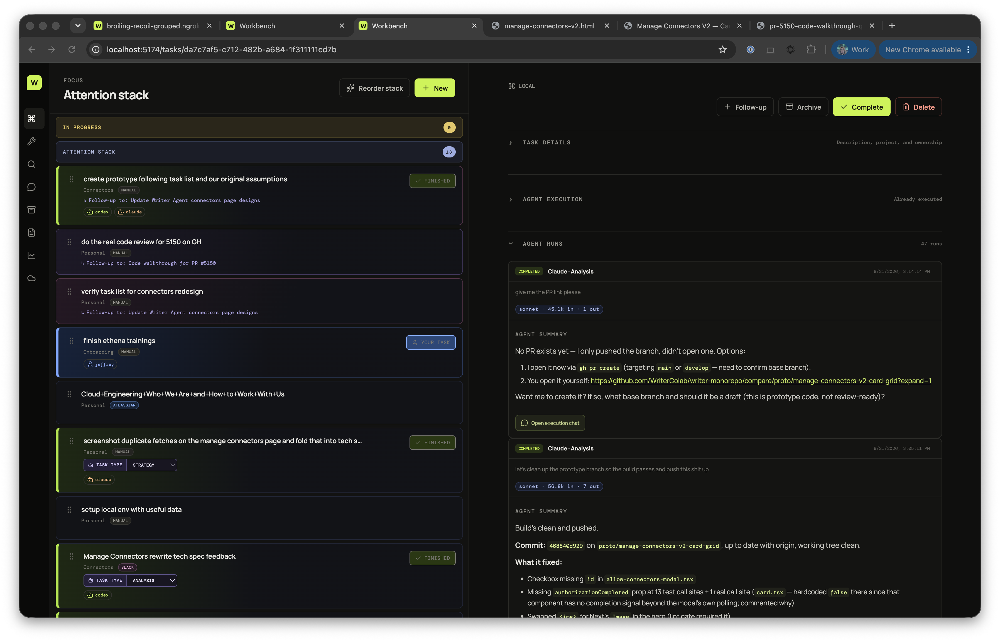

# Workbench

Workbench is a local-first engineering work queue for one person working with Codex and Claude. It keeps the order you care about, agent conversations, source context, and task history together—without turning every Linear issue into a task.

It is a TypeScript + React app with an Express API and a local SQLite database.

## What it does

- **Attention stack.** The list order is the priority: the item at the top gets attention first. Workbench separates active agent work from the attention stack, archived work, and Workbench’s own roadmap.
- **Deliberate task intake.** Add a manual task, paste a supported source URL, search connected sources, or describe work to AI. New tasks land at the top of the relevant stack.
- **Agent execution.** Execute a task with Codex, Claude, or both. Workbench keeps the task, runs, conversation, streamed output, model selection, attachments, findings, retries, cancellations, and follow-ups linked together.
- **Shared context.** The conversation workspace is shared by both agents. A task-created conversation always links back to its task; follow-ups retain their parent relationship.
- **Nightly discovery.** A scheduled scan can collect potential work from connected sources. You review candidates and choose which ones become tasks; it never silently changes your queue.
- **Source-aware work.** Linear, GitHub, Slack, Figma, and Atlassian can provide task context through the configured connections. Google Workspace remains unavailable until there is an approved Writer connector.
- **Artifacts.** Agent-created Markdown, HTML, and text artifacts can be opened safely from approved development roots and published as sanitized, read-only snapshots for sharing.
- **Insights.** The app derives operational signals from persisted run and activity history, including retry and agent-handoff activity. It does not present made-up cost data.

## Screenshots

The attention stack stays visible while you review task details and agent-run history.



## Architecture

Workbench intentionally keeps the interface that controls agents separate from the checkout agents edit:

```text
source checkout (/dev/workbench) ── agent edits ──> preview (localhost:5174)
        │                                            │
        └──────── shared SQLite state ───────────────┘
                                                     │
                                      explicit promotion after review
                                                     │
                                                     ▼
                                      immutable live runtime (localhost:5173)
```

- **Source checkout:** the editable repository. Workbench-targeted agents work here.
- **Preview (`5174`):** a read-only Vite mirror of live Workbench. It reads the live API on `5173`, cannot mutate it, and never owns the scheduler or agent processes.
- **Live (`5173`):** a stable gateway serves an immutable, promoted snapshot. It keeps working while an agent edits the source checkout.
- **State:** database, attachments, published artifact metadata, and logs live under `data/` by default and are not committed.

Promotion builds the current checkout, snapshots the built client and server, then switches the gateway only after a health check.

## Requirements

- Node.js 22.19 or newer
- npm 10 or newer

## Start Workbench

Install dependencies, create an initial immutable release, then start the stable gateway:

```bash
npm install
npm run runtime:promote
npm run runtime:start
```

Open [http://localhost:5173](http://localhost:5173).

For development and review, start the preview in a separate terminal:

```bash
npm run preview
```

Open [http://localhost:5174](http://localhost:5174). Preview reads real tasks and conversations from live Workbench but blocks every mutation, so it is safe for review without replacing the control plane. Use `npm run preview:sandbox` only when a change needs an isolated writable preview API and database copy.

When the change is ready, ask an agent to **approve the Workbench preview** or run:

```bash
npm run runtime:promote
```

The same live URL (`5173`) switches after the new release passes its health check. `npm run dev` is for isolated API/client development; it is not the recommended daily control plane.

### Health check

```bash
curl http://localhost:5173/api/health
```

## Everyday workflow

1. Start with the attention stack. Its order is your priority; drag tasks to reorder them.
2. Add work through **New**: search a source, paste a URL, describe work to AI, or make a manual task.
3. Review and edit the task’s title, description, project, owner, classification, and model before execution.
4. Click **Execute**. The task moves optimistically to In progress; the task-executed toast links to its conversation without stealing focus.
5. Steer the agent from the linked conversation. Messages written while an agent is responding are queued rather than canceling the current response.
6. Review its report, create only the follow-up tasks you want, then complete or archive the task. Completing a task archives it; its conversation follows the same archival rule.

For complex work, the agent should first produce independently executable follow-up tasks instead of continuing to work ambiguously on one giant parent task.

## Sources and MCP

Use **Sources** only to inspect connection state or start the appropriate authentication flow. Search happens while adding a task, not from a separate source browser.

| Source | Intended use | Connection notes |
| --- | --- | --- |
| Linear | Search and resolve issues/projects; seed tasks from existing descriptions | Configure a personal API key in `.env`. Provider fields remain provider-owned. |
| GitHub | Search Writer, Writer Internal, and WriterColab issues and pull requests; resolve pasted links | Uses the configured authenticated connector. |
| Slack | Resolve pasted Slack links and search when creating a task | Uses the managed authenticated MCP connector; Workbench does **not** require a Slack app or Slack client secrets. |
| Figma | Resolve pasted design links for agent work | Uses the managed Figma MCP connection. Starting Figma auth should open the provider’s authorization window once. |
| Atlassian | Search and resolve Jira and Confluence links | Uses the configured remote MCP connection. Refresh the Sources view after authorization if the status is stale. |
| Google Workspace | Planned Docs, Drive, and Gmail context | Disabled until Writer IT provides an approved connector. |

### Linear configuration

Create a Linear personal API key and add it to `.env`:

```dotenv
LINEAR_API_KEY=lin_api_...
```

Linear synchronization is read-only. Workbench owns queue order, local assignments, agent history, and manual task fields; Linear owns its title, description, workflow status, project, labels, URL, and due date.

### Shared Workbench MCP API

Codex and Claude can access the same canonical Workbench state through the Streamable HTTP endpoint:

```text
http://localhost:5173/mcp
```

For non-loopback use, authenticate with `Authorization: Bearer <WORKBENCH_TOKEN>`. The MCP API gives Codex and Claude the same admin control Jeffrey has in the UI: tasks and stack ordering, discoveries and scans, conversations and agent dispatch, execution plans and their approval, artifact publication and revocation, and runtime promotion. It does not expose provider credentials or direct SQLite access — those are not Workbench operations.

## Nightly discovery

Install the scheduled discovery job once:

```bash
npm run discovery:install
```

Run a scan on demand with:

```bash
npm run discovery:scan
```

Discovery favors teammate code-review requests and Connectors-team signals, while retaining other relevant work. It proposes candidates and a suggested queue ordering; you can accept or reject the ordering and select exactly which candidates become tasks. Existing task order is preserved unless meaningful newer context—or neglected age—warrants a move.

## Open Workbench on your phone

Start the stable runtime, then create an outbound tunnel:

```bash
npm run runtime:start
npm run share
```

`share` prints the link. The first visit on a device needs the `?token=` URL once; it sets a long-lived cookie so the bare URL works afterwards. The token grants full access to the queue and can trigger agent work, so treat it like a password.

For a stable ngrok hostname, add the domain to `.env`:

```dotenv
NGROK_DOMAIN=your-name.ngrok-free.app
```

If you instead have a Cloudflare hostname and named tunnel, configure `TUNNEL_HOSTNAME`. Cloudflare quick tunnels are suitable only for temporary sharing.

## Publish artifacts for coworkers

Artifact links are private previews by default. Use **Share** to publish a sanitized, read-only snapshot; it contains no Workbench navigation, task database, API access, or local filesystem path.

Configure a Cloudflare Pages project and public base URL:

```dotenv
ARTIFACT_PAGES_PROJECT=workbench-artifacts
ARTIFACT_PUBLIC_BASE_URL=https://artifacts.example.com
# Optional for unattended deployment; local development can use `npx wrangler login`.
CLOUDFLARE_ACCOUNT_ID=...
CLOUDFLARE_API_TOKEN=...
```

Republishing a changed file creates a new version. A stable artifact URL always serves the current version; versioned URLs preserve prior snapshots. Unchanged files are skipped by content hash. Revoke takes all versions offline while retaining their history.

To enable optional coworker feedback on a published artifact, configure the public Workbench URL:

```dotenv
WORKBENCH_PUBLIC_URL=https://your-name.ngrok-free.app
```

Only artifact-feedback submission is then reachable without a Workbench token; all Workbench data remains protected.

## Security and data

- `WORKBENCH_TOKEN` gates non-loopback access to the Workbench UI and API. `/api/health` stays open for health checks.
- The tokenized share URL is a full-access credential. Rotate it by changing `WORKBENCH_TOKEN` and restarting the share tunnel.
- SQLite defaults to `data/workbench.db`; it is ignored by Git.
- Artifact previews are restricted to approved development roots. Add trusted sibling roots through a comma-separated `WORKBENCH_ARTIFACT_ROOTS` value.
- Do not commit `.env`, database files, attachments, local logs, provider tokens, or tunnel credentials.

## Commands

```bash
npm run runtime:promote  # build and atomically promote a verified immutable release
npm run runtime:start    # serve the stable runtime on localhost:5173
npm run preview          # read-only live-data preview UI on 5174
npm run preview:sandbox  # isolated writable preview UI + API
npm run dev              # isolated API + Vite development
npm run share            # expose the stable runtime through a configured tunnel
npm run discovery:scan   # run discovery now
npm run discovery:install # install the nightly discovery schedule
npm run typecheck
npm test
npm run lint
npm run build
```

## Product direction

Workbench is intentionally an execution cockpit, not a second Linear. The user controls the stack; agents handle research, planning, implementation, review, and decomposition. The next worthwhile work is making those loops more reliable: stronger source retrieval, durable agent execution, clear task/conversation lifecycle signals, and actionable insights grounded in persisted data.
