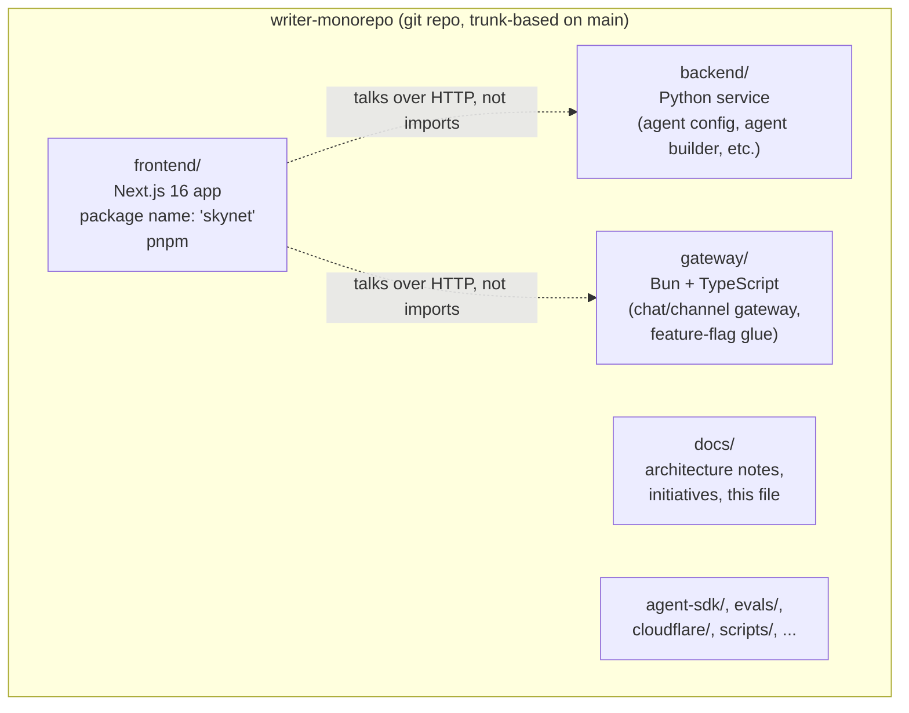
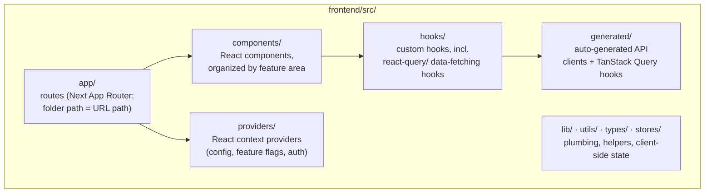
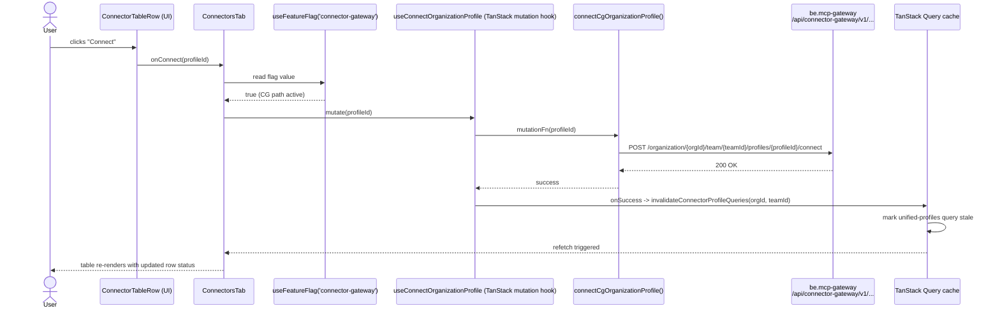
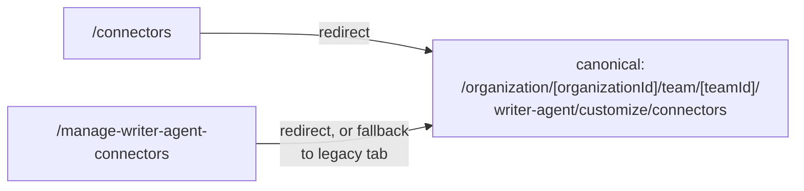
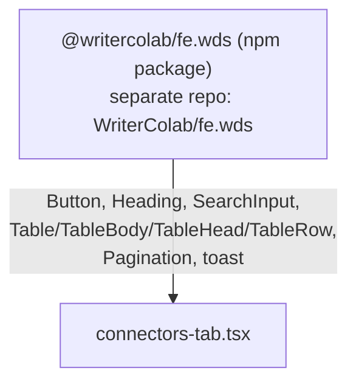
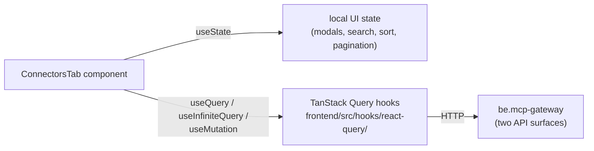
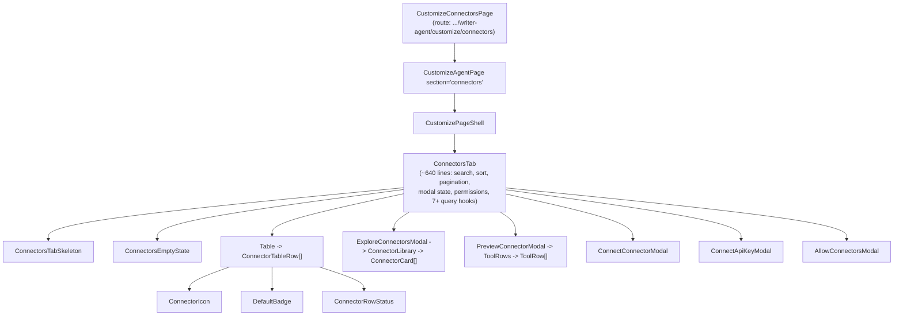
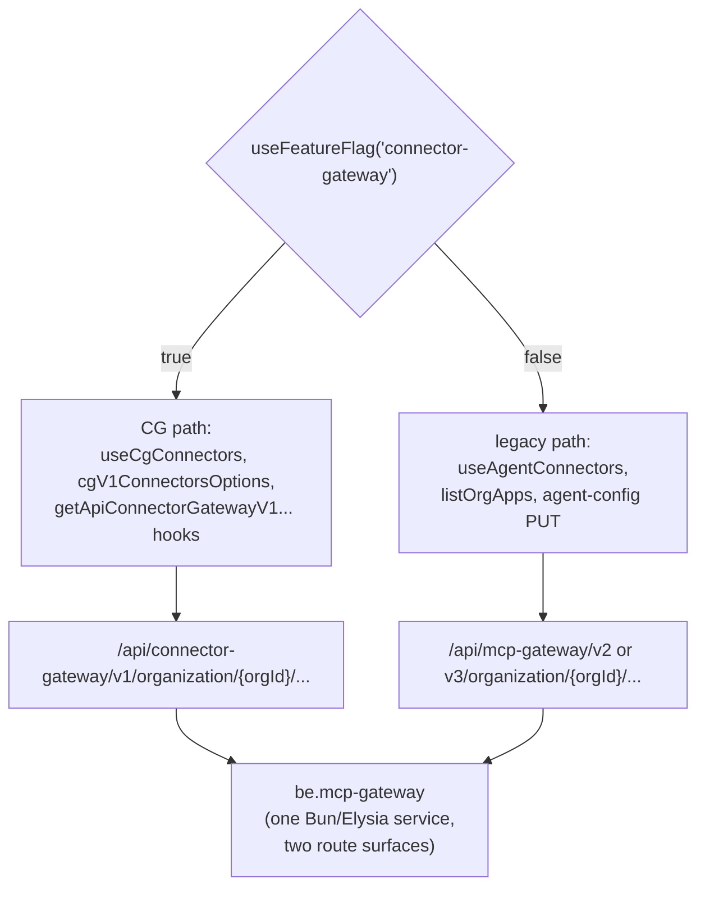
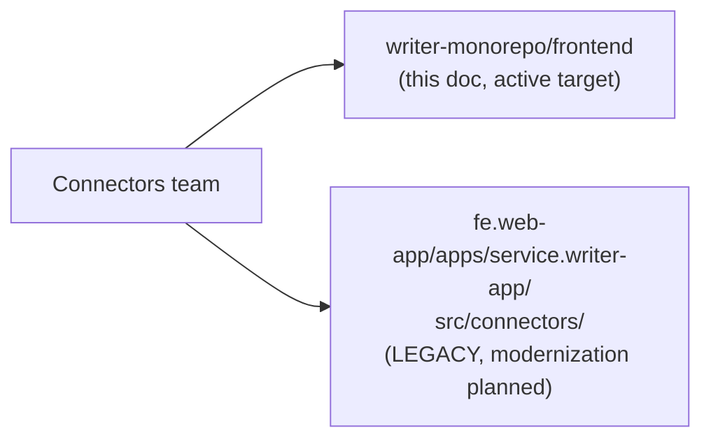

# Frontend architecture walkthrough (for a new connectors-team engineer)

Welcome. This document assumes you know how to code but know nothing about this specific codebase.
Every internal term is defined the first time it's used. Diagrams come first; the prose under each one
just explains what you're looking at.

By the end you should be able to answer: "I want to change X on the connectors page — which file?"
Section 6 is a cheat sheet for exactly that.

---

## 1. What is a monorepo, and what's in this one

A **monorepo** is one git repository that holds several otherwise-separate applications and services,
instead of each one living in its own repo. You clone once, and everything is in front of you.

`writer-monorepo` (checked out at `~/dev/writer-monorepo`) is one of Writer's monorepos. It is **not**
a single npm/pnpm workspace with one root `package.json` — there is no root `package.json` at all.
Instead, each top-level folder is a largely independent project with its own toolchain, dependency
manager, and lockfile. They live in the same repo for coordinated review and deploy, not because they
share a build graph.



The piece you'll spend nearly all your time in is `frontend/`. Its `package.json` `name` field is
literally `"skynet"` — that's also the internal deployment name (`skynet-frontend`), which is worth
knowing so Slack/Grafana references make sense later.

The **connectors page you own is entirely inside `frontend/`.** The two backend services it depends on
(`connector-gateway` and `mcp-gateway`) are not in this repo at all — they live in a separate repo,
`WriterInternal/be.mcp-gateway`, checked out nowhere on this machine but readable via the GitHub API.
More on that in Section 3.

*Verified by reading the repo directly: no root `package.json`, `frontend/package.json` name is
`"skynet"`, `backend/` is a Python tree (`api.py`, `alembic/`, etc.), `gateway/` is Bun/TypeScript
(`bun.lock`, `biome.jsonc`).*

---

## 2. Where the frontend app lives and how it's built

`frontend/` is a **Next.js** app (Next 16, using the **App Router** — the folder-based routing
convention where a folder under `src/app/` becomes a URL path, and a `page.tsx` inside it is the
page component). It builds with `next build --turbopack` and currently runs as `output: 'standalone'`
(a server-rendering mode) — not a static export. There's a stated future direction of moving away from
Next.js toward a plain static/web-components build, but nothing in the code shows that migration has
started yet; treat it as a direction of travel, not current behavior.



A **route** in this app is a real folder path. For example, the connectors page route lives at:

```
frontend/src/app/organization/[organizationId]/team/[teamId]/writer-agent/customize/connectors/page.tsx
```

`[organizationId]` and `[teamId]` are Next.js **dynamic segments** — folder names in square brackets
become URL parameters. So visiting
`/organization/4821/team/17/writer-agent/customize/connectors` renders this `page.tsx`, with
`organizationId = "4821"` and `teamId = "17"` available to the component.

That file is intentionally thin — three lines — because Next.js requires a `page.tsx` per route, but
the real work is delegated to a shared component:

```tsx
// frontend/src/app/.../connectors/page.tsx (verified, full file contents)
import { CustomizeAgentPage } from '@/components/ui/customize/customize-agent-page';

export default function CustomizeConnectorsPage() {
  return <CustomizeAgentPage section="connectors" />;
}
```

*Verified: `frontend/package.json` scripts (`next dev --turbopack`, `next build --turbopack`),
`frontend/next.config.ts` (`output: 'standalone'`), the App Router folder layout under
`frontend/src/app/`, and the exact contents of the connectors `page.tsx` shown above.*

---

## 3. How a click becomes a screen update

Two internal terms you need before this diagram makes sense:

- **TanStack Query** — a library that manages "server state" in React: it fetches data, caches it
  under a **query key** (an array that identifies what was fetched, e.g.
  `['mcp-gateway', 'v3', 'unified-user-profiles', orgId, teamId]`), tracks loading/error state, and
  lets you "invalidate" (mark stale and refetch) that cache after a mutation.
- **Feature flag** — a runtime on/off switch, read from a flag service, that lets code branch to two
  different implementations without a deploy. This app can read flags from either **Statsig** or
  **LaunchDarkly**; `useFeatureFlag('connector-gateway')` is one specific flag.
- **Backend gateway** — a backend HTTP service the frontend calls over the network (not imported as
  code). Connectors has two: **`mcp-gateway`** (the older API surface) and **`connector-gateway`**
  (the newer one, abbreviated **CG**). Both are hosted by the *same* backend service,
  `WriterInternal/be.mcp-gateway`, just under different URL prefixes
  (`/api/mcp-gateway/*` vs `/api/connector-gateway/*`). The frontend picks which prefix to call based
  on the `connector-gateway` feature flag.

Here is a real flow: a user enables a connector on the connectors page (clicking "Connect" on a row),
traced through actual hook and function names in the code.



If the flag were `false`, the same click would instead go through a different hook
(`agentConnectors` / the legacy agent-config PUT mutation) and hit `/api/mcp-gateway/...` instead —
same UI, different network path, different response shape. `ConnectorsTab` computes this branch once
near the top of the component:

```tsx
// frontend/src/components/agents/manage-tabs/connectors-tab.tsx (verified excerpt)
const { configData, onConnectorEnabledChange, ... } = useConnectorGateway ? cgConnectors : agentConnectors;
```

*Verified by reading: `useFeatureFlag` in `frontend/src/hooks/use-feature-flags.ts`;
`useConnectOrganizationProfile` (a TanStack `useMutation` wrapping `connectCgOrganizationProfile`,
with `onSuccess: () => invalidateConnectorProfileQueries(...)`) in
`frontend/src/hooks/react-query/mcp-gateway/use-gateway.ts:538-548`; the `useConnectorGateway ? cgConnectors : agentConnectors` branch in
`frontend/src/components/agents/manage-tabs/connectors-tab.tsx` (~line 181). The exact request/response
payload shapes were not executed at runtime — this traces the code path, not an observed network call.*

---

## 4. The building blocks

### 4a. Routing

Next.js App Router: URL structure mirrors the folder structure under `frontend/src/app/`. Square
brackets (`[organizationId]`) are dynamic params; parentheses (`(auth)`) are route groups that
organize files without adding a URL segment. The connectors page also has two short "convenience"
routes that redirect into the canonical one:



*Verified: `frontend/src/app/connectors/page.tsx` and
`frontend/src/app/manage-writer-agent-connectors/page.tsx` exist as separate route files from the
canonical one; redirect logic itself (in `customize-simple-url-redirect.tsx`) was carried over from
`writer-connectors-page-map.md`, not re-read line-by-line in this session.*

### 4b. Components

Components live under `frontend/src/components/`, organized by feature area (e.g.
`components/agents/manage-tabs/` for the connectors table and its modals,
`components/connectors/` for smaller shared pieces like the connector icon). There's no strict
atomic-design layering — page-specific components and shared components sit near each other, and
figuring out which is which matters before you edit (see Section 4c and Section 6).

### 4c. The Writer Design System (WDS)

**WDS** is Writer's shared component library, published as an npm package,
`@writercolab/fe.wds` (confirmed as a real pinned dependency, version `1.105.1` in
`frontend/package.json`), with a published **Storybook** (a hosted catalog of the components and
their variants) that the Figma design files link directly into. You should not build a new button,
table, or dialog primitive from scratch — pull it from WDS.



The connectors page imports WDS primitives directly at the top of its main file:

```tsx
// frontend/src/components/agents/manage-tabs/connectors-tab.tsx (verified excerpt)
import {
  Button, Heading, SearchInput, Table, TableBody, TableHead, TableHeader, TableRow, Pagination,
} from '@writercolab/fe.wds';
```

Not everything that *looks* like a design-system piece is one — `DefaultBadge` on the connectors page
wraps an app-local badge component (`frontend/src/components/ui/badge.tsx`), not a WDS import. Check
the import statement, not the visual, before assuming a component is upstream in WDS.

*Verified: the `@writercolab/fe.wds` dependency and version in `frontend/package.json`; the exact
import list shown above, read directly from `connectors-tab.tsx`. The DefaultBadge/WDS distinction and
the Storybook URL are carried over from `writer-frontend-stack.md` (the Storybook URL itself was
flagged there as unreached from a sandboxed session — still unverified).*

### 4d. State and data-fetching

Two different kinds of state show up on this page, and it matters which one you're touching:

- **Server state** (data that lives on a backend and can go stale) — handled by **TanStack Query**
  (`@tanstack/react-query`, confirmed `^5.75.2` in `frontend/package.json`). Custom hooks under
  `frontend/src/hooks/react-query/` wrap `useQuery`, `useInfiniteQuery`, and `useMutation`.
- **Local UI state** (is this modal open, what's the search text) — handled with plain React
  `useState`, visible throughout `connectors-tab.tsx` (`isAddConnectorModalOpen`, `searchTerm`, etc.).



*Verified: `@tanstack/react-query` version in `frontend/package.json`; the mixed `useState` /
`useQuery`/`useInfiniteQuery`/`useMutation` usage read directly in `connectors-tab.tsx` and
`use-gateway.ts`.*

---

## 5. Where connectors fits

### 5a. Component tree



`ConnectorsTab` (`frontend/src/components/agents/manage-tabs/connectors-tab.tsx`) is the main
change-concentration point — it owns search, client-side sort, client-side pagination, modal state,
permission checks, feature-flag branching, and the mutation calls, all in one file. That's a known,
named piece of tech debt on this team's plate, not an accident of this doc.

*Verified directly: the file exists at the stated path, is ~640 lines, imports 7+ query/mutation
hooks (`useConnectOrganizationProfile`, `useListUnifiedUserProfiles`, `useDeleteProfile`,
`useCgConnectors`, `useSignedLogoUrls`, `useAgentConnectors`, plus the modals' own hooks), and contains
the `useState` calls for every modal listed. The rest of the tree below `ConnectorTableRow` (Icon,
Badge, Status, and the modal internals) is carried over from `writer-connectors-page-map.md` and not
individually re-opened in this session.*

### 5b. Which backend a call hits, and why



Both URL prefixes are served by the **same backend service** — `WriterInternal/be.mcp-gateway` —
just under different route trees (`src/connector-gateway/` vs the legacy MCP gateway routes). That's
why the flag switches *contract*, not *host*: same origin, different response shape, different
`staleTime`/`gcTime` cache settings on the frontend side, so loading/empty/error states genuinely
differ between the two paths.

The CG path additionally passes through an **adapter** —
`frontend/src/hooks/react-query/mcp-gateway/connector-gateway-adapter.ts` — that reshapes CG's native
response into the legacy shape the rest of `ConnectorsTab` expects. This adapter is known to drop some
fields (profile ownership/visibility, several app metadata fields, tool parameters/timestamps); see
`docs/initiatives/connectors/connector-gateway-adapter-field-loss.md` for the full ledger before
relying on a field that flows through it.

*Verified in this session: the `useFeatureFlag('connector-gateway')` branch pattern, appearing
identically in `useListMcpGatewayApps`, `useListTools`, and `ConnectorsTab` itself; that both URL
prefixes point at generated clients under `frontend/src/generated/mcp-gateway/`; that
`be.mcp-gateway` is one service per its own README structure (`src/routes/` split into legacy and
`src/connector-gateway/`). The adapter's specific field-loss claims are carried over from
`writer-frontend-stack.md` / the field-loss ledger doc, not independently re-audited field-by-field
in this session.*

### 5c. The other connectors page — `fe.web-app` (legacy)

There is a **second, separate implementation of a connectors page**, in a different repository,
`WriterInternal/fe.web-app` (checked out at `~/dev/fe.web-app`), under
`apps/service.writer-app/src/connectors/`. It is owned by the same connectors team but is considered
**legacy** and is not the target of new design work — new work (e.g. the CON-159 redesign) targets
the `writer-monorepo/frontend` implementation covered in this document.



*Verified in this session: `apps/service.writer-app/src/connectors/` exists in `~/dev/fe.web-app` and
contains `organisims/`, `entities/`, `features/`, `legacy/`, `pages/`, etc. — a real, separate
implementation, confirming it isn't just a stub or redirect. The "legacy, not CON-159's target"
framing is carried over from `writer-product-surfaces.md` and `writer-fe-web-app-local-setup.md`,
sourced from Jeffrey's own 1:1 notes rather than independently re-derived here.*

---

## 6. A map for finding your way

| I want to change... | Look in |
|---|---|
| The connectors page URL / route registration | `frontend/src/app/organization/[organizationId]/team/[teamId]/writer-agent/customize/connectors/page.tsx` |
| Page width, heading, outer spacing (shared across Connectors/Skills/Voice) | `frontend/src/components/ui/customize/customize-page-shell.tsx` |
| Search bar, table columns, pagination, loading/error states | `frontend/src/components/agents/manage-tabs/connectors-tab.tsx` |
| A single row's layout or its menu | `frontend/src/components/agents/manage-tabs/connector-table-row.tsx` |
| Connector logo/icon (high blast radius — 15+ other consumers) | `frontend/src/components/connectors/connector-icon.tsx` |
| The "Explore connectors" modal / library grid | `frontend/src/components/agents/manage-tabs/explore-connectors-modal.tsx`, `connector-library.tsx` |
| The connector detail / tools preview modal | `frontend/src/components/agents/manage-tabs/preview-connector-modal.tsx` |
| OAuth / API-key / consent dialogs | `connect-connector-modal.tsx`, `connect-api-key-modal.tsx`, `allow-connectors-modal.tsx` (same directory) |
| Which backend a data call hits, and the CG/legacy branch itself | `frontend/src/hooks/react-query/mcp-gateway/use-gateway.ts` |
| What data the CG adapter drops or renames | `docs/initiatives/connectors/connector-gateway-adapter-field-loss.md` |
| Permission / who-can-see-what rules | `docs/` under `writer-connectors-permission-model.md` in your own notes, and `be.mcp-gateway/src/connector-gateway/profile/shared/is-tool-allowed.ts` / `is-tool-selected.ts` for enforcement |
| A WDS component's available variants | The WDS Storybook (published from `WriterColab/fe.wds`) |
| The legacy, non-target connectors implementation | `~/dev/fe.web-app/apps/service.writer-app/src/connectors/` |

---

## Verification notes

**Confirmed by directly reading code in this session** (file paths cited inline above; repos read
were `~/dev/writer-monorepo` and `~/dev/fe.web-app`):
- No root `package.json`; `frontend/` is its own pnpm/Next.js project named `"skynet"`; `backend/` is
  Python; `gateway/` is Bun/TypeScript.
- The App Router folder structure under `frontend/src/app/`, including the exact connectors route
  path and the full contents of its `page.tsx`.
- `next.config.ts` sets `output: 'standalone'`, and the build scripts use `next build --turbopack`.
- `@writercolab/fe.wds` is a real pinned dependency (`1.105.1`) and is imported directly by
  `connectors-tab.tsx` (`Button`, `Heading`, `SearchInput`, `Table` family, `Pagination`, `toast`).
- `@tanstack/react-query` `^5.75.2` is a real dependency; `connectors-tab.tsx` uses `useQuery`,
  `useInfiniteQuery`, and `useMutation` hooks from `frontend/src/hooks/react-query/`.
- The `useFeatureFlag('connector-gateway')` flag exists (`frontend/src/hooks/use-feature-flags.ts`)
  and gates parallel code paths in `useListMcpGatewayApps`, `useListTools`, and `ConnectorsTab`'s own
  `useConnectorGateway ? cgConnectors : agentConnectors` branch.
- `useConnectOrganizationProfile` is a real TanStack mutation hook
  (`use-gateway.ts:538-548`) that calls `connectCgOrganizationProfile` and invalidates the profiles
  query cache on success — the basis for the Section 3 sequence diagram.
- `apps/service.writer-app/src/connectors/` exists as a real, populated directory in `~/dev/fe.web-app`.
- `DefaultBadge` on the connectors page wraps an app-local component, not a `@writercolab/fe.wds`
  import.

**Carried over from `~/notes/knowledge/` without independent re-verification this session** (out of
scope for a docs pass to re-derive from scratch; flagged as static-code-verified as of 2026-08-19 by
that knowledge base, not runtime-verified by anyone):
- The full component tree below `ConnectorTableRow` (icon/badge/status internals) and the modal
  internals' exact prop wiring.
- The specific field-by-field list of what the CG adapter drops (profile ownership, app metadata,
  tool parameters/timestamps) — the adapter file and its general lossy behavior were spot-checked by
  path, but the full field ledger was not re-walked.
- The redirect logic inside `customize-simple-url-redirect.tsx`.
- That `be.mcp-gateway` is one Bun/Elysia service with two route surfaces — taken from
  `writer-repo-and-environment-map.md`, which documents having read that repo via the GitHub API; not
  re-read independently in this session since it isn't checked out locally.
- The WDS Storybook's live existence/URL — explicitly flagged in the source notes as unreached from a
  sandboxed session.
- `fe.web-app`'s connectors page being "legacy" and out of scope for new design work — this is
  Jeffrey's own stated framing from his 1:1, not something derivable purely from the code.

**Inferred, not confirmed:**
- That the Next.js-to-static/web-components migration "has not started" is an inference from the
  absence of web-components tooling and the `standalone` build mode, not a statement anyone on the
  team made about current plans.
- Nothing in this document was verified against a running app, an actual network request, or an
  actual feature-flag value in any environment — all tracing here is static (reading source), not
  runtime observation.
